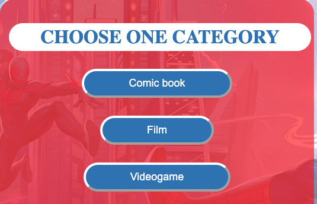

# **Spider-Man Quiz** 

On this website you can find an interactive quiz game with Spider-Man related questions and theme. You can navigate it easily and you can do it on every device no matter what screen size it has, and if you would like you can listen the Spider-Man theme song while you doing the quiz.

[You can try it here on the live website!](https://viktormathe.github.io/spiderman-quiz/)

## _**Contents**_

* [User experience](#user-experience)
    * [Future ideas](#future-ideas)

* [Design](#design)
    * [Colors](#colors)
    * [Font](#font)
    * [Images](#images)
    * [Audio](#audio)

* [Deployment](#deployment)

* [Testing](#testing)
    * [W3C Validator](#html-validator)
    * [CSS Validator](#css-validator)
    * [JSHint](#javascript)
    * [Lighthouse](#lighthouse)
    * [Full testing](#full-testing)
    * [Solved bugs](#solved-bugs)
    * [Known bugs](#known-bugs)

* [Credits](#credits)
    * [Content](#content)
    * [Media](#media)

## _**User experience**_

My idea was to create a quiz game to all the generation who like the superheros comic books,films or videogames.There are 5 questions in each category and there is a timer as well which gives you 60 seconds to answer the questions. They can challenge their knowledge about these categroies.

 The marvel movies is very popular nowadays and my sons are big fan of the Spider-Man that's why I choose this character. I hope everybody will enjoy it who tries the quiz.
 
 ### _Future ideas:_
  * I would like to add new questions 
  * Randomize the answers as well
  * Make sure the user know which answer was the correct

