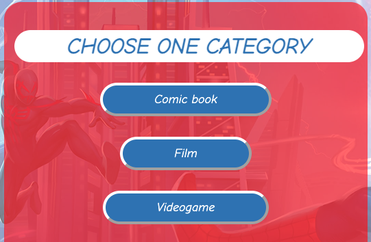
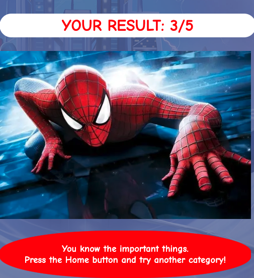
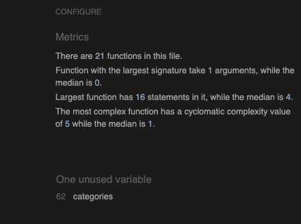
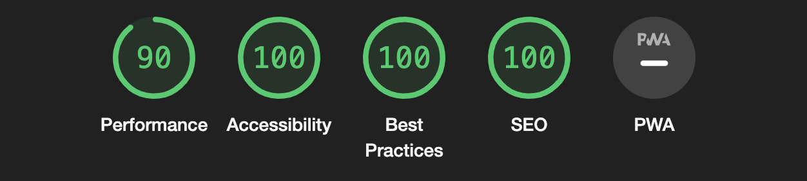
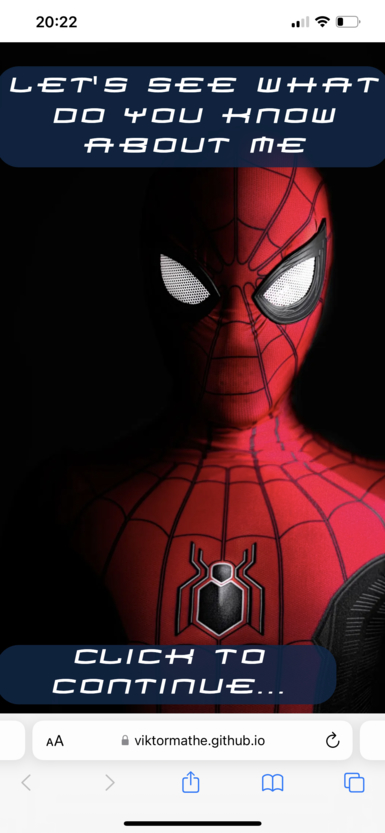
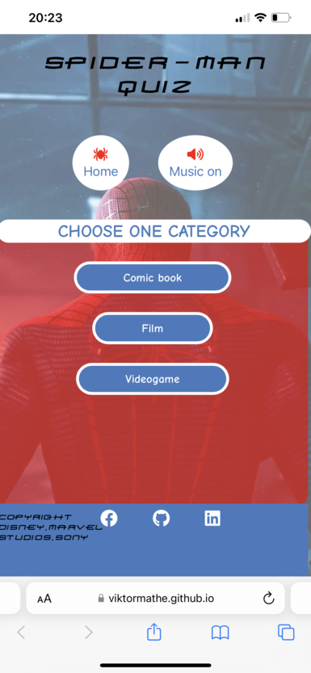
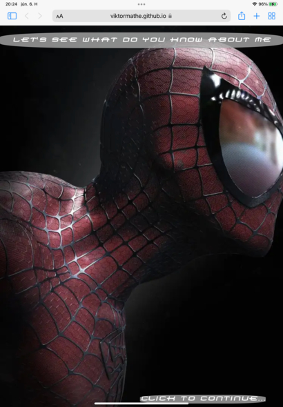
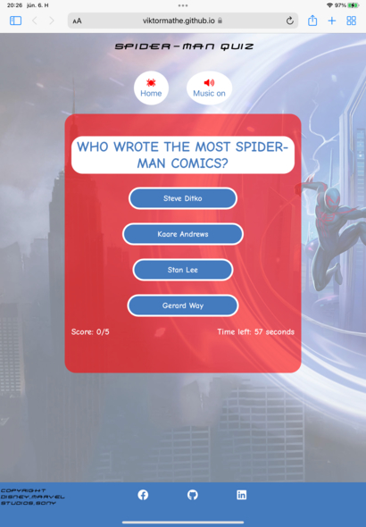

# **Spider-Man Quiz** 

On this website you can find an interactive quiz game with Spider-Man related questions and theme. You can navigate it easily and you can do it on every device no matter what screen size it has, and if you would like you can listen the Spider-Man theme song while you doing the quiz.

[You can try it here on the live website!](https://viktormathe.github.io/spiderman-quiz/)

## _**Contents**_

* [User experience](#user-experience)
    * [Future ideas](#future-ideas)

* [Design](#design)
    * [Colors](#colors)
    * [Font](#font)
    * [Images](#images)
    * [Audio](#audio)

* [Deployment](#deployment)

* [Testing](#testing)
    * [W3C Validator](#html-validator)
    * [CSS Validator](#css-validator)
    * [JSHint](#javascript)
    * [Lighthouse](#lighthouse)
    * [Full testing](#full-testing)
    * [Solved bugs](#solved-bugs)
    * [Known bugs](#known-bugs)

* [Credits](#credits)
    

## _**User experience**_

My idea was to create a quiz game to all the generation who like the superheros comic books,films or videogames.There are 5 questions in each category and there is a timer as well which gives you 60 seconds to answer the questions and you can find a score number as well which is counting how many correct answers did you have.

 They can challenge their knowledge about these categroies.

 The marvel movies is very popular nowadays and my sons are big fan of the Spider-Man that's why I choose this character. I hope everybody will enjoy it who tries the quiz,at the end is a result page which is let you know how many correct answers did you have and it show you different images and messages according to the score what you get.

 
 
 ### _Future ideas:_
  * I would like to add new questions 
  * Randomize the answers as well
  * Make sure the user know which answer was the correct

  ## _**Design**_

  * ### _Colors:_
    * I added a grey coloured (rgb(169, 169, 169, 0.8)) background with 80% opacity to the heading on the welcome page to make sure the user can see it easily.
    * The box which contains the questions and the categories is red (rgba(255, 0, 0, 0.6)) with 60% opacity. 
    * The questions are wrote with blue (#447BBE) colour with a white background while the answers are the other way around.
    * The result box is blue (#447BBE) and the result came up on it with red (rgba(255, 0, 0)) colour and a white background.
    * I choose these colours because these are Spider-Man's main color scheme.

  * ### _Font:_
    * I download a Spider-Man themed font from the [1001 Fonts website](https://www.1001fonts.com/homoarakhn-font.html), which is free to use for everybody and applyed it on the welcome page and the copyright information on the footer.

    * The rest of the page is using a Comic Neue font from the [Google Fonts](https://fonts.google.com/specimen/Comic+Neue?preview.text=Questions&preview.text_type=custom&query=comic).

  * ### _Images:_
    * I found the images from the web ([Google](https://www.google.com/search?q=spiderman+images&newwindow=1&source=lnms&tbm=isch&sa=X&ved=2ahUKEwjCi4nCoJf4AhWTXsAKHR_LAaUQ_AUoAXoECAEQAw&biw=1920&bih=945&dpr=1)), and one image been downloaded from the [Unsplash website](https://unsplash.com/s/photos/spiderman)

  * ### _Audio:_
    * I found the theme song on the [YouTube](https://www.youtube.com/watch?v=j8deCNfNjO4&list=LL&index=2) which has no copyright on it and I could download it from the following [link](https://drive.google.com/file/d/1nwQRvlF6HnAgeZIeMmzKsoG1iGTKsz80/view).

## _**Deployment**_

This site was deployed to GitHub Pages by following these steps:
1. Login or Sign Up to [GitHub](www.github.com).
2. Create a new repository named "spiderman-quiz".
3. Once created, click on "Settings" on the navigation bar under the repository title.
4. Scroll down to "GitHub Pages".
5. Under "Source", choose which branch to deploy. I chose "master", but this is sometimes shown as "main".
6. Choose which folder to deploy from, usually "/root".
7. Click "Save", then wait for it to be deployed. It can take some time for the page to be fully deployed.
8. Your URL will be displayed above "Source".
9. [Live website](https://viktormathe.github.io/spiderman-quiz/)

## _**Testing**_

* ### _W3C Validator:_
    * I got back the following message : Document checking completed. No errors or warnings to show. from the official [W3C Website](https://validator.w3.org/nu/?doc=https%3A%2F%2Fviktormathe.github.io%2Fspiderman-quiz%2F)

* ### _CSS Validator:_
    * I got back the following message: Congratulations! No Error Found. from the [Jigsaw Validator](https://jigsaw.w3.org/css-validator/validator?uri=https%3A%2F%2Fviktormathe.github.io%2Fspiderman-quiz%2F&profile=css3svg&usermedium=all&warning=1&vextwarning=&lang=en)

* ### _JSHint:_
    * On this validator I got back only one "unused variable" which I will mention in the known bugs section.

    

* ### _Lighthouse:_
    * I done the lighthouse check through an incognito because that is when I got back the real result which are the following:

    

    The performance keep jumping up and down but always still in the green area.

* ### _Full testing:_
    * I tested my website on my computer which I use with 2 screens and has different resolutions. This way I can straight make it kind of responsive for each desktop types. Towards I tested on my phone to make sure it is accesible from a mobile as well, if you using on a mobile it has a different welcome picture which is looks better on a phone. I used an iPad Air (2020) to make sure the welcome page is looks good with the heading and not fade in to the picture. I had to make the heading smaller so in that way is not overhanging from the background image and stays in the normal reading size. I had to check the quiz box is accesible and you can see all the answers and the questions in the box with the timer and scores as well. I was happy because it seems to work on the devices what I tried.I had to make sure the footer is always on the right place as well. I attached few images about the responsive desing below.

 

s  

 * ### _Solved bugs_:

    1. My first bug was to make sure the user can see the questions and answers from the JS file which been pushed to the html. On my first try I made a an array for the questions and it has an array for the categories and an array to the individual questions to each category and I could target the question with a [0] index number and so on but my mentor suggested this is not the best way to do it and I have to make sure it is readable to other people so I restructred it and give the questions a name like "question: ....", "answer1: ..." ,"correctanswer: ..." .I could make a string from it with an [..array] method and it was easy to target them with an innerText method with all the unique names.

    2. The quiz function with the score numbers are went really smoothly but when I finished the quiz and you restarted it the questions just was not there in the array anymore because the current question been spliced and when I restarted it did not went back to the original form. To sort that I had to use a JSON method which was did a deep copy from the questions so when I restarted it went back normally, but after 2 round it did not find the questions again. Then I get an advise the read [this website](https://dev.to/samanthaming/how-to-deep-clone-an-array-in-javascript-3cig) which is told me I did the questions array all wrong becuase I used single and double quotes and the JSON method just working with double quotes.

    3. At the end I realized if I started a quiz and before I finished it pressed the Home button it did not stop the counter and when it is ended just took me to the result page when I was not even doing anything. It was easy to solve I just had to make sure the resetting function is attached to the home button since than it works alright.

 * ### _Known bugs:_

    1. I just found one bug what I know which is shows in the JSHint report. The categories is an unused variable, which is really not but the categories function using an 'onclick' method instead of the event listener and the JSHint can not read other files that is why I have this trouble. I will make sure it is change to the event listener in the future.

* ## _**Credits**_

    * 