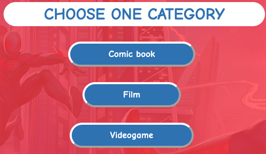

# **Spider-Man Quiz** 

On this website you can find an interactive quiz game with Spider-Man related questions and theme. You can navigate it easily and you can do it on every device no matter what screen size it has, and if you would like you can listen the Spider-Man theme song while you doing the quiz.

[You can try it here on the live website!](https://viktormathe.github.io/spiderman-quiz/)

## _**Contents**_

* [User experience](#user-experience)
    * [Future ideas](#future-ideas)

* [Design](#design)
    * [Colors](#colors)
    * [Font](#font)
    * [Images](#images)
    * [Audio](#audio)

* [Deployment](#deployment)

* [Testing](#testing)
    * [W3C Validator](#html-validator)
    * [CSS Validator](#css-validator)
    * [JSHint](#javascript)
    * [Lighthouse](#lighthouse)
    * [Full testing](#full-testing)
    * [Solved bugs](#solved-bugs)
    * [Known bugs](#known-bugs)

* [Credits](#credits)
    * [Content](#content)
    * [Media](#media)

## _**User experience**_

My idea was to create a quiz game to all the generation who like the superheros comic books,films or videogames.There are 5 questions in each category and there is a timer as well which gives you 60 seconds to answer the questions. They can challenge their knowledge about these categroies.

 The marvel movies is very popular nowadays and my sons are big fan of the Spider-Man that's why I choose this character. I hope everybody will enjoy it who tries the quiz.
 
 ### _Future ideas:_
  * I would like to add new questions 
  * Randomize the answers as well
  * Make sure the user know which answer was the correct

  ## _**Design**_

  * ### _Colors:_
    * I added a grey coloured (rgb(169, 169, 169, 0.8)) background with 80% opacity to the heading on the welcome page to make sure the user can see it easily.
    * The box which contains the questions and the categories is red (rgba(255, 0, 0, 0.6)) with 60% opacity. 
    * The questions are wrote with blue (#447BBE) colour with a white background while the answers are the other way around.
    * The result box is blue (#447BBE) and the result came up on it with red (rgba(255, 0, 0)) colour and a white background.
    * I choose these colours because these are Spider-Man's main color scheme.

  * ### _Font:_
    * I download a Spider-Man themed font from the [1001 Fonts website](https://www.1001fonts.com/homoarakhn-font.html), which is free to use for everybody and applyed it on the welcome page and the copyright information on the footer.

    * The rest of the page is using a Comic Neue font from the [Google Fonts](https://fonts.google.com/specimen/Comic+Neue?preview.text=Questions&preview.text_type=custom&query=comic).

  * ### _Images:_
    * I found the images from the web ([Google](https://www.google.com/search?q=spiderman+images&newwindow=1&source=lnms&tbm=isch&sa=X&ved=2ahUKEwjCi4nCoJf4AhWTXsAKHR_LAaUQ_AUoAXoECAEQAw&biw=1920&bih=945&dpr=1)), and one image been downloaded from the [Unsplash website](https://unsplash.com/s/photos/spiderman)

  * ### _Audio:_
    * I found the theme song on the [YouTube](https://www.youtube.com/watch?v=j8deCNfNjO4&list=LL&index=2) which has no copyright on it and I could download it from the following [link](https://drive.google.com/file/d/1nwQRvlF6HnAgeZIeMmzKsoG1iGTKsz80/view).

## _**Deployment**_

This site was deployed to GitHub Pages by following these steps:
1. Login or Sign Up to [GitHub](www.github.com).
2. Create a new repository named "spiderman-quiz".
3. Once created, click on "Settings" on the navigation bar under the repository title.
4. Scroll down to "GitHub Pages".
5. Under "Source", choose which branch to deploy. I chose "master", but this is sometimes shown as "main".
6. Choose which folder to deploy from, usually "/root".
7. Click "Save", then wait for it to be deployed. It can take some time for the page to be fully deployed.
8. Your URL will be displayed above "Source".
9. [Live website](https://viktormathe.github.io/spiderman-quiz/)

## _**Testing**_

* ### _W3C Validator:_
    * I got back the following message : Document checking completed. No errors or warnings to show. from the official [W3C Website](https://validator.w3.org/nu/?doc=https%3A%2F%2Fviktormathe.github.io%2Fspiderman-quiz%2F)

* ### _CSS Validator:_
    * I got back the following message: Congratulations! No Error Found. from the [Jigsaw Validator](https://jigsaw.w3.org/css-validator/validator?uri=https%3A%2F%2Fviktormathe.github.io%2Fspiderman-quiz%2F&profile=css3svg&usermedium=all&warning=1&vextwarning=&lang=en)

* ### _JSHint:_
    * On this validator I got back only one "unused variable" which about I will write in the known bugs section.

    

* ### _Lighthouse:_
    * I done the lighthouse check through an incognito because that is when I got back the real result which are the following:

    

    The performance keep jumping up and down but always still in the green area.